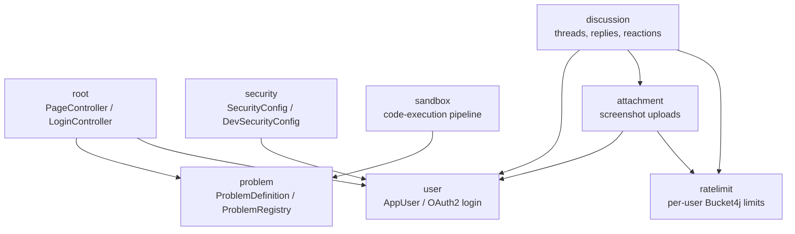
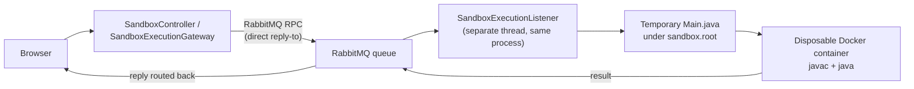

# Online Java Sandbox

> A browser-based Java playground and programming-practice platform built with Spring Boot, Docker, RabbitMQ, PostgreSQL, and GitHub OAuth — designed and built solo, in the open, as a real production system rather than a demo.

**Status:** Early development, live in production
**Last updated:** 25 September 2026
**Live demo:** https://java.ruslanlomaka.org

## The idea

Most "write code in the browser" projects stop at a `<textarea>` and an `eval`. Online Java Sandbox exists to answer a harder question: what does it actually take to let strangers run arbitrary Java on your server, safely, at production quality, end to end?

That single problem — safe arbitrary code execution — touches almost every discipline in backend engineering, which is exactly why it was chosen as the spine of this project:

- **Untrusted execution.** Submitted code runs inside disposable, network-isolated Docker containers with dropped capabilities, resource limits, and automatic cleanup, invoked over a real message-queue request/reply hop (RabbitMQ), not a direct method call.
- **Real infrastructure, not a sandboxed demo.** This isn't a repo you `docker compose up` and forget. It's deployed 24/7 on a Raspberry Pi at home, fronted by a Cloudflare Tunnel, with GitHub Actions deploying straight to it on every merge to `master`, no staging environment, real consequences for a bad merge.
- **A full application around that core**, not just a code runner: GitHub OAuth login, a discussion forum per problem with threaded replies, Markdown, reactions and screenshot uploads, and a real in-browser code editor (Monaco) with IntelliJ-style shortcuts and Java formatting that runs entirely client-side.
- **Defense in depth everywhere a user can touch the system**: locked-down containers for code execution, a two-layer sanitizer plus a strict CSP for user-generated Markdown, re-encoded and dimension-capped image uploads, per-user rate limiting, and CSRF protection on every state change.
- **A real delivery pipeline**, not just `git push`: Checkstyle, a full test suite against a real Postgres container, a SonarQube Cloud quality gate, AI-assisted review from CodeRabbit on every pull request, and Renovate opening automated dependency-update PRs.

It's deliberately unfinished and honest about it — see [Current limitations](#current-limitations) and the [Roadmap](#roadmap) below. The goal isn't a polished product; it's a project transparent and well-documented enough that someone can read it end to end and actually learn how these pieces fit together, or use it to build a portfolio of their own. See [Looking for contributors](#looking-for-contributors).

## What's done

**Core platform**

- Sign in with GitHub (OAuth2); a database user is created on first login and refreshed on every later one.
- Write, format, and run Java in the browser, then see automatic pass/fail test results in a terminal-style, colour-coded console.
- Solve structured Java problems grouped into two navbar menus: **Data Structures** (Arrays, Strings, Hash Maps & Sets, Stacks & Queues, Linked Lists, Trees, Graphs, Heaps) and **Algorithms** (Sorting, Searching, Two Pointers, Sliding Window, Recursion & Backtracking, Dynamic Programming, Greedy). Four problems are live today: Bubble Sort, Binary Search, Two Sum, and Longest Substring Without Repeating Characters.
- Discuss each problem with other users: threaded replies, Markdown with copyable syntax-highlighted code blocks, emoji, six fixed reactions, and pasted or dropped screenshots.

**Code editor**

- Monaco (the VS Code editor component), vendored and trimmed to only the languages this project needs: rainbow brackets, indentation guides, Java autocomplete, and IntelliJ shortcuts (Ctrl+Alt+L to format, Ctrl+Alt+O to optimize imports, Ctrl+Enter to run, Ctrl+D to duplicate a line).
- Java formatting runs **entirely client-side**: a vendored, lazily-loaded build of Prettier plus its Java plugin formats the code in the browser, with no round trip to the server. Formatting a whole file and formatting just a method body (used when a hidden-test harness needs to stay hidden) both go through the same formatter, wrapping/unwrapping a synthetic class as needed. This replaced an earlier server-side approach built on the Eclipse JDT parser/formatter — moving it into the browser cut out a network hop and a whole Java dependency.
- A dedicated output classifier colours every line of program/test output by what it is — pass, fail, compiler error, stack trace, exception, summary — and renders a pass/fail status badge above the console. Output is always inserted as text, never HTML, so a program that prints `<script>` just prints that string.

**Problem architecture**

- Every problem is a small Java class implementing `ProblemDefinition`, tagged with a topic, and registered in a central `ProblemRegistry` — no per-problem controllers, pages, or JavaScript.
- One route (`/problems/{topic}/{slug}`), one template, one script renders every problem; old category URLs 301-redirect to the new ones.
- The full test harness — imports, the student's code, and the hidden tests — is assembled **server-side**. Only the student's method body is ever sent to the browser, so hidden tests stay hidden.
- A dedicated verification test compiles and runs every harness against both a known-correct and a known-wrong reference solution, so a broken problem definition fails the build instead of shipping silently.

**Discussions and user content**

- Two-level threads (a root post plus a flat list of replies, with "↪ replying to @user" quoting), soft delete, author-only edit/delete enforced server-side.
- Markdown is rendered server-side with raw HTML escaped, passed through an OWASP allowlist sanitizer, and sanitized again in the browser with DOMPurify — two independent layers, not one.
- Screenshot uploads are format-sniffed (not trusted by file extension), size- and dimension-capped, and **re-encoded** on the server, which strips EXIF/GPS metadata and anything else hidden in the file. Unused uploads are purged after 24 hours by a scheduled job.
- Every page ships a strict Content-Security-Policy; third-party scripts are pinned CDN versions with SRI hashes or vendored locally.
- Posts, reactions, and uploads are all rate-limited per user (Bucket4j, backed by an in-memory Caffeine cache).

**Execution pipeline**

- The web tier never runs code directly. A controller hands submitted source to a gateway that sends it over RabbitMQ (using direct reply-to for the RPC-style reply) and blocks until a listener — running on a separate thread in the same process — returns a result.
- Every submission gets a random correlation ID propagated through SLF4J's MDC across the whole journey (controller → queue → listener → container → reply), so one request's full path is grep-able in the logs.
- Runner containers: no network access, dropped Linux capabilities, CPU/process/file-descriptor/output-size limits, a read-only filesystem, an execution timeout, a bounded number of concurrent containers, automatic cleanup plus a scheduled reaper for orphans, and an image pinned by digest rather than a mutable tag.

**Delivery pipeline**

- Every pull request runs Checkstyle (Google Java Style), the full JUnit/Spring MVC-slice/Testcontainers-backed test suite against a real PostgreSQL container, the Node-based JS unit test suite (editor autocomplete, formatter, console classifier — pure functions, no framework needed), and a SonarQube Cloud quality gate that blocks merging on new bugs, vulnerabilities, or security hotspots.
- CodeRabbit posts an AI-generated review with security-focused instructions per package on every pull request.
- Renovate opens grouped pull requests for dependency updates (Maven minor/patch bumps grouped together, GitHub Actions grouped together, other major bumps left as their own reviewable PR) — except Postgres, where major-version bumps are disabled outright rather than left for review: one was merged as a routine tag swap and crash-looped the production database, since a Postgres major bump needs `pg_upgrade` or a dump/restore first, not just an image tag change.
- Pushes to `master` deploy automatically: GitHub Actions connects to the Raspberry Pi over Tailscale, resets it to `origin/master`, and rebuilds with `docker compose up -d --build`. There is no staging environment.

## Tech stack

| Category | Technologies |
|---|---|
| Backend | Java 21, Spring Boot 4.1, Spring MVC, Spring Security + OAuth2 client (GitHub login), Spring Data JPA, Spring AMQP, Spring Validation, Thymeleaf |
| Data & messaging | PostgreSQL, Flyway migrations, RabbitMQ (request/reply execution hop), Caffeine (in-memory rate-limit cache) |
| Code execution | Docker, Docker Compose, `eclipse-temurin` JDK runner images |
| Editor & frontend | Monaco editor (vendored), Prettier + `prettier-plugin-java` (vendored, client-side Java formatting), EasyMDE, highlight.js, DOMPurify, emoji-picker-element |
| Content & security | commonmark-java, OWASP Java HTML Sanitizer, Bucket4j (rate limiting), Content-Security-Policy + hardening headers |
| Testing & quality | JUnit 5, Spring MVC slice tests, Testcontainers (PostgreSQL), Node.js built-in test runner (`node --test`, for the JS formatter/console/autocomplete logic), Checkstyle (Google Java Style), SonarQube Cloud |
| Delivery & ops | GitHub Actions, Renovate (automated dependency updates), CodeRabbit (AI pull-request review), Cloudflare Tunnel, Raspberry Pi, Tailscale (CI-to-Pi deploy access) |

## Architecture at a glance

Each feature lives in its own package, and the dependencies between them only
ever point one way — verified directly against the imports, not just intended:



No package ever imports back "up" the graph — `problem` and `user` don't know
`sandbox` or `discussion` exist, which is what keeps each feature independently
testable and removable.

## How execution works

Code execution goes through RabbitMQ rather than being handled directly by the
web request thread:



The listener runs in the same Spring Boot process as the web tier — this isn't
a separate deployable service (that's still a future roadmap item, see
[Security](#security)). RabbitMQ is used here as a real request/reply hop
(an RPC call over a message queue), not just for background events.

Every request is tagged with a random correlation ID, generated once per
submission and attached to every log line for that request's whole journey —
controller, queue, listener, container start/finish, and reply — via SLF4J's
MDC. Run `docker compose logs -f app | grep <the-id>` to see one submission's
full path end to end, which is especially useful for debugging on the
Raspberry Pi where there's no separate log aggregation tool.

Runner containers currently use:

| Restriction | How |
|---|---|
| Network | `--network none` — no network access at all |
| CPU | `--cpus` limit |
| Processes | `--pids-limit` |
| Filesystem | `--read-only` root, small writable `tmpfs` at `/work` only |
| Capabilities | `--cap-drop ALL` |
| Resource ulimits | file descriptor and file size limits |
| Time | hard execution timeout, container force-killed past it |
| Concurrency | bounded number of containers running at once |
| Output | size cap — containers are killed if output exceeds the limit |
| Cleanup | automatic on every run, plus a scheduled reaper for orphaned containers/directories |
| Image | pinned by digest, not by a mutable tag |

Memory limits (`--memory`) are set on the container but are not
currently enforced on the host, so this is not yet a real resource
guarantee — see [Current limitations](#current-limitations).

This is still an experimental project and not yet fully hardened for unrestricted public code execution.

## Problem discussions

Every registered problem has a discussion page at
`/problems/{category}/{slug}/discussion`, linked from the problem page as
"Discussion (N)". Only users signed in with GitHub can read or post.

- **Users.** The first login creates an `app_user` row keyed by
  `(provider, provider_user_id)`, and each later login refreshes the
  name and avatar. `AppUserLoginService` hooks into Spring Security's
  OAuth2 login. The principal (`AppUserPrincipal`) carries the database id,
  which is used for ownership checks.
- **Threads.** Threads are two levels deep: a top-level post plus a flat list of replies.
  Replying to a reply keeps it in the same thread and shows a
  "↪ replying to @user" quote.
- **Content.** Posts are Markdown, with `java` code blocks (highlighted, with a
  Copy button), tables, links, emoji and pasted or dropped screenshots.
  Authors can edit or delete their own posts. Deletion is soft, so replies keep
  their context. There are six fixed reactions (👍 ❤️ 🎉 😄 🤔 🚀).
- **Storage.** Posts, reactions and screenshots live in PostgreSQL. The schema
  is managed by Flyway (`src/main/resources/db/migration`), and Hibernate only
  validates it.

Security measures:

| Threat | Defense |
|---|---|
| XSS via Markdown | Server-side HTML escaping → OWASP allowlist sanitizer → DOMPurify again in the browser (two independent layers) |
| Tracking / exfiltration via images | Images may only point at this site's own `/attachments/{uuid}` URLs |
| Malicious/oversized uploads | 2 MB / 4096×4096 px caps; format detected from file bytes, not the file name; every image is **re-encoded**, stripping EXIF/GPS metadata and anything else hidden in the file |
| Stale/unused uploads | Purged automatically after 24 hours if no post embeds them |
| IDOR (editing/deleting someone else's post) | Ownership checked server-side, never trusted from the client |
| CSRF | Every state-changing request requires a CSRF token |
| Abuse / spam | Posts, reactions and uploads rate-limited per user (Bucket4j) |
| General page-level XSS | Strict Content-Security-Policy on every page; third-party scripts pinned to CDN versions with SRI hashes |

## Current architecture

Every problem goes through one generic, data-driven path:

- Each problem is a small Java class (e.g. `BubbleSortProblem`) implementing `ProblemDefinition`, tagged with a `Topic`, and registered in `ProblemRegistry`.
- Problem URLs are `/problems/{topic}/{slug}` (e.g. `/problems/sorting/bubble-sort`), rendered by one template (`problem.html`) and one script (`problem.js`). Older category URLs redirect permanently.
- The full test harness (imports, student code, hidden tests) is assembled **server-side** (`ProblemDefinition.buildTestSource`); only the student's method body is ever sent to the browser, so hidden tests stay hidden.
- `HarnessVerificationTest` compiles and runs every harness with a known-correct and a known-wrong reference solution (`src/test/resources/solutions/`), so a broken harness fails the build.

Separately, code execution itself now goes through RabbitMQ as a real request/reply
hop instead of being called directly — see [How execution works](#how-execution-works)
for the full flow and why.

Java formatting inside the editor is a third, independent pipeline: a vendored
Prettier build with the Java plugin runs entirely in the browser (see
[What's done](#whats-done)), so it has no dependency on the sandbox, RabbitMQ,
or the server at all.

## Roadmap

| Area | Progress |
|---|---|
| Near term | 9 / 12 |
| Database & users | 3 / 7 |
| Security | 2 / 6 |
| Delivery & tooling | 4 / 5 |
| Collaboration | 0 / 7 |
| Optional ideas | 0 / 5 |
| **Total** | **18 / 42** |

### Near term

- [x] create reusable problem definitions;
- [x] separate hidden tests from HTML (done for Arrays problems);
- [x] create a generic problem page;
- [x] add output-size limits;
- [x] add execution queue (concurrency limit);
- [x] migrate every problem onto the generic problem page;
- [x] group problems into Data Structures / Algorithms topics;
- [x] replace CodeMirror with Monaco;
- [x] move Java formatting fully client-side (Prettier), with a colour-coded terminal-style console;
- [ ] improve error handling;
- [ ] improve mobile layout;
- [ ] add more Java problems.

### Database and users

- [x] create user entities;
- [x] store GitHub user data;
- [ ] save attempts;
- [ ] track completed problems;
- [ ] add user profiles;
- [ ] add progress statistics;
- [x] add comments and discussions.

### Security

- [x] limit concurrent runner containers;
- [ ] restore working memory limits (the `--memory` flag is set, but not currently enforced on the host running the containers);
- [ ] separate the runner from the web application;
- [ ] reduce Docker socket exposure;
- [x] add abuse prevention for discussions (rate limits, sanitization);
- [ ] add stronger isolation.

### Delivery and tooling

- [x] Checkstyle enforced in CI;
- [x] SonarQube Cloud quality gate;
- [x] AI-assisted pull-request review (CodeRabbit);
- [x] automated dependency updates (Renovate);
- [ ] a staging environment before production deploys.

### Collaboration

- [ ] contribution guide;
- [ ] pull-request template;
- [ ] issue templates;
- [ ] beginner-friendly tasks;
- [ ] contributor credits;
- [ ] public backlog;
- [ ] lightweight Scrum workflow when the team grows.

### Optional ideas

- [ ] AI-generated hints;
- [ ] compiler-error explanations;
- [ ] edge-case suggestions;
- [ ] code-review feedback;
- [ ] learning recommendations.

AI would be used only as a learning feature, not as a replacement for solving problems.

## Looking for contributors

I am looking for people who want to build a real portfolio project together.

This may be especially useful for developers who are looking for a job but do not yet have many projects they feel proud to show.

You do not need to be an expert.

I am ready to explain:

- how GitHub OAuth was configured;
- how Spring Security protects the application;
- how submitted Java code runs in Docker;
- how RabbitMQ is used as a request/reply hop for code execution, and how
  correlation-ID logging traces one request across it;
- how the in-browser Java formatter works, and why it moved off the server;
- how the Raspberry Pi deployment works;
- how PostgreSQL and Docker Compose are configured;
- how the CI/CD pipeline and quality gates (Checkstyle, SonarQube Cloud, CodeRabbit, Renovate) work;
- why the remaining problem pages still need migrating to the generic architecture.

What I need from contributors:

- ideas;
- curiosity;
- time;
- willingness to discuss and improve the project.

Useful contribution areas include:

- Java problems;
- Spring Boot;
- frontend work;
- Docker;
- security;
- testing;
- documentation;
- architecture;
- UI/UX.

When three or more active contributors join, we can move to a lightweight Scrum-style process with a backlog, small tasks, reviews, and regular planning.

## Easy ways to help

You can start with something small:

- suggest a new problem;
- improve a task description;
- add edge cases;
- improve CSS;
- improve documentation;
- review architecture;
- help separate problem definitions from HTML;
- improve security;
- open an issue.

You do not need to configure the full production environment just to contribute an idea or problem.

## Development mode

Development mode is available for contributors who want to run and change the
project locally without configuring GitHub OAuth credentials or a production
deployment. It still needs a local RabbitMQ container and a small `.env` file
now, since code execution always goes through RabbitMQ regardless of profile
(see [How execution works](#how-execution-works)), plus a local PostgreSQL
for users and discussions.

### Requirements

- Git;
- JDK 17 or newer; JDK 21 is recommended;
- Docker Engine or Docker Desktop;
- IntelliJ IDEA or another Java IDE.

### Setup

Clone the repository:

```bash
git clone https://github.com/RuslanLomaka/OnlineJavaSandbox.git
cd OnlineJavaSandbox
```

Download the Java runner image before starting the application:

```bash
docker pull eclipse-temurin:21-jdk
```

Verify that Docker works without `sudo`:

```bash
docker ps
```

On Linux, if Docker reports a socket permission error, add your user to the Docker group:

```bash
sudo usermod -aG docker "$USER"
```

Log out and back in before continuing so the new group membership takes effect.

Create a `.env` file with just RabbitMQ credentials (dev mode doesn't need
the Postgres or GitHub OAuth values from `env.example`, only these two):

```env
RABBITMQ_USER=
RABBITMQ_PASSWORD=
```

Start RabbitMQ (only this one service, not the whole `compose.yaml` stack —
dev mode runs the app itself directly via IntelliJ, not in Docker):

```bash
docker compose up -d rabbitmq
```

The first run downloads the `rabbitmq` image automatically; no separate
`docker pull` needed. Confirm it's up with `docker compose ps`, and optionally
check the management UI at `http://localhost:15672` (log in with the
credentials from your `.env`).

Start a local PostgreSQL for users and discussions. Flyway creates the
tables on the first start:

```bash
docker run -d --name online-java-dev-db -p 127.0.0.1:5432:5432 \
  -e POSTGRES_DB=online_java -e POSTGRES_HOST_AUTH_METHOD=trust postgres:17
```

Dev mode connects to `jdbc:postgresql://127.0.0.1:5432/online_java` as user
`postgres` by default. To use a different database, set `DEV_DATASOURCE_URL`,
`POSTGRES_USER` and `POSTGRES_PASSWORD` in `.env`.

### Run with IntelliJ IDEA

1. Open the project in IntelliJ IDEA.
2. Select JDK 21 as the project SDK.
3. Open the `OnlineJavaApplication` run configuration.
4. Set **Active profiles** to `dev`.
5. Run `OnlineJavaApplication`.
6. Open `http://localhost:8080/sandbox`.

Development mode:

- bypasses GitHub login: every request is signed in as a fixed `local-dev`
  user, so posting and uploads work locally (the app refuses to start this
  way unless it is bound to `127.0.0.1`);
- connects to the local PostgreSQL started above;
- disables template and static-resource caching;
- binds the web server to `127.0.0.1`;
- connects to the RabbitMQ container started above (`127.0.0.1:5672`) to run
  submitted code, same request/reply flow as production uses;
- runs submitted Java code in restricted Docker containers;
- disables networking inside runner containers.

Development mode is intended for trusted local machines. Stop the application
(and, if you're done for a while, `docker compose stop rabbitmq`) when you are
finished working.

## Production-like local setup

```bash
git clone https://github.com/RuslanLomaka/OnlineJavaSandbox.git
cd OnlineJavaSandbox
cp env.example .env
docker compose up -d --build
```

Required `.env` values:

```env
GITHUB_CLIENT_ID=
GITHUB_CLIENT_SECRET=

POSTGRES_DB=online_java
POSTGRES_USER=postgres
POSTGRES_PASSWORD=

SPRING_DATASOURCE_URL=jdbc:postgresql://postgres:5432/online_java
DOCKER_API_VERSION=1.41

RABBITMQ_USER=
RABBITMQ_PASSWORD=
```

Do not commit `.env`. Deploying to a new host (including the Raspberry Pi)
means setting all of these there manually — they are never carried over by a
`git pull`/deploy, since `.env` is gitignored on purpose.

**If you already have a `postgres-data` volume from before this repo moved to
Postgres 18** (the `postgres` service's `volumes:` entry now mounts at
`/var/lib/postgresql` instead of `/var/lib/postgresql/data`), `docker compose
up -d --build` will *not* migrate it — the 18+ image expects its data one
level down from where the old 17-era layout put it, and refuses to start
rather than risk touching data it doesn't recognize. Either run `pg_upgrade`
(or a `pg_dump`/restore) into a fresh volume before upgrading, or, if the
existing data isn't worth keeping, remove the volume (`docker compose down`
then `docker volume rm <project>_postgres-data`) and let Postgres 18
initialize a clean one — Flyway rebuilds the schema on the app's next start
either way.

## Useful commands

```bash
docker compose up -d --build
docker compose ps
docker compose logs -f app
docker compose logs -f postgres
docker compose logs -f rabbitmq
docker compose down
```

To trace one code submission's full journey (web request through RabbitMQ to
the Docker container and back), grab the correlation ID from the start of any
log line and grep for it:

```bash
docker compose logs -f app | grep <correlation-id>
```

RabbitMQ's management UI is available at `http://<host>:15672` (Pi or
localhost) using the `RABBITMQ_USER`/`RABBITMQ_PASSWORD` from `.env` — useful
for watching queue depth while multiple submissions run concurrently.

## CI/CD

Every pull request against `master` runs Checkstyle, the full Java test suite against a real PostgreSQL service container, the Node-based JS unit tests (editor formatter, console classifier, autocomplete), and a SonarQube Cloud analysis with a quality gate that blocks merging on new bugs, vulnerabilities, or security hotspots. Pushes to `master` additionally deploy automatically: GitHub Actions connects to the Raspberry Pi over Tailscale, resets it to `origin/master`, and runs `docker compose up -d --build`. There is no staging environment — a merge to `master` goes straight to the live site.

CI does not run a RabbitMQ service — verified that the test suite still passes without one reachable, since Spring AMQP retries connecting in the background rather than failing application startup. The only cost is a noisy (harmless) connection-refused stack trace in the CI test logs.

Renovate (`renovate.json`) opens grouped pull requests for outdated dependencies — Maven minor/patch bumps grouped into one PR, GitHub Actions grouped into another, and other major version bumps left as their own individually-reviewable PR. It goes through the exact same CI pipeline as a human PR before it's mergeable, and is never auto-merged, precisely because there's no staging environment to catch a bad bump before it reaches production.

One dependency is exempt from even getting a PR: Postgres major-version bumps are disabled entirely, after one was merged as a routine `docker-compose` tag update and crash-looped the production database on the Pi — a Postgres major upgrade needs `pg_upgrade` or a dump/restore first, and there's no way to express that as a mergeable one-line diff, so Renovate no longer proposes it at all.

## Code review with CodeRabbit

Pull requests are also reviewed by [CodeRabbit](https://coderabbit.ai), an AI
reviewer that is free for public repositories. It posts a summary and line
comments on each PR, and you can talk to it by mentioning `@coderabbitai` in a
PR comment. `.coderabbit.yaml` sets it up and gives it security-focused
instructions for the security, discussion and attachment code. To enable it,
install the CodeRabbit GitHub App on the repository.

## Manual deployment

Only needed if the automatic deployment above isn't available:

```bash
cd ~/projects/OnlineJavaSandbox
git pull
docker compose up -d --build
```

## Current limitations

- no saved attempts;
- no scores;
- no user profiles;
- no working memory limit on the current host (the container flag is set but not enforced there);
- problems are still defined in code; only users and discussions are stored in the database;
- discussions don't update live; new messages appear after a page reload;
- code execution now has a new dependency: if RabbitMQ is down or unreachable, submissions fail gracefully (a clear error message, not a crash), but the app cannot run any code at all until it's back — a single point of failure that didn't exist when execution was a direct method call;
- Java formatting depends on the browser downloading and running a ~480 KB vendored Prettier bundle on first use; there's no server-side fallback if that fails to load.

## Author

Created by [Ruslan Lomaka](https://github.com/RuslanLomaka).

## License

A license has not yet been selected.
